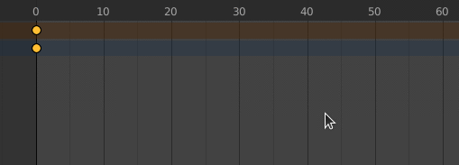

# Shift Keyframes v1.0
This is a simple addon that adds After-Effects-like hotkeys for moving keyframes around quickly in the timeline.

### Hotkeys
- <b>alt + left/right</b> - Moves selected keyframe(s) by 1 frame
- <b>shift + alt + left/right</b> - Moves selected keyframe(s) by 10 frames

### Installation
Just download the .py file and install it like any other addon.
